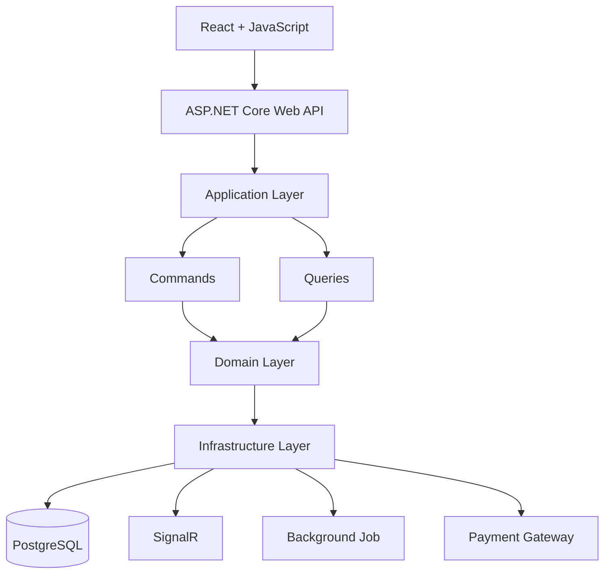

# Flight Booking Management System

A modern full-stack flight booking platform built with ASP.NET Core, React, Clean Architecture, and CQRS, providing a real-time seat reservation experience, secure online payments, and a comprehensive administration dashboard.

---

## Table of Contents

- Overview
- Key Features
- System Architecture
- Tech Stack
- Project Structure
- Installation
- Configuration
- Running with Docker
- Authentication & Authorization
- Roles & Permissions
- Realtime Features
- Future Improvements

---

## Overview

The Flight Booking Management System is a platform that allows users to search for flights, book seats in real time, complete secure online payments, and manage their bookings through an intuitive interface.

From the administrator's perspective, the system provides comprehensive tools for managing airports, airlines, aircraft, flight schedules, routes, bookings, services, users, and system operations from a single centralized dashboard.

---

## Key Features

### User Features

- **Register & Login** — secure authentication using JWT with role-based authorization
- **Search Flights** — find flights by departure, destination, date, airline, and seat class
- **View Flight Details** — browse schedules, aircraft information, available seats, and pricing
- **Real-time Seat Selection** — reserve seats with live synchronization powered by SignalR
- **Online Payments** — securely pay for bookings via integrated payment gateway
- **Booking History** — view current reservations and completed bookings
- **Manage Profile** — update personal information and account settings.

### Admin Features

- **Dashboard** — monitor key statistics and system activities
- **Manage Airports** — create, update, and organize airport information
- **Manage Airlines** — maintain airline records and operating information
- **Manage Airport** — manage aircraft details and seating configurations
- **Manage Routes** — configure routes between airports
- **Manage Flights** — schedule flights, assign aircraft, and manage seat availability
- **Manage Bookings** — monitor reservations, ticket status, and payment records
- **Manage Services** — configure additional services and ticket options
- **Manage Users & Roles** — control user accounts and role permissions
- **View Reports** — analyze bookings, revenue, and operational statistics
  
---

## System Architecture

The backend follows the Clean Architecture pattern combined with CQRS (Command Query Responsibility Segregation) to achieve a clear separation of concerns, improve maintainability, and support future scalability



---

## Tech Stack

| Category | Technologies |
|-----------|-------|
| **Frontend** | React, JavaScript, Vite |
| **Backend** | ASP.NET Core 8 Web API, C#, Clean Architecture, CQRS, MediatR |
| **Database** | PostgreSQL, Entity Framework Core |
| **Authentication** | ASP.NET Core Identity, JWT Authentication |
| **Real-time Communication** | SignalR |
| **Payment Gateway** | VNPay (Sandbox) |
| **Validation & Mapping** | FluentValidation, Mapster |
| **Logging** | Serilog |
| **Serilog** | Structured logging (Console + File sinks) |
| **Containerization** | Docker, Docker Compose, Nginx |
| **API Documentation** | Swagger / Swashbuckle  |
| **Asp.Versioning** | API versioning |

---

## Project Structure

```
FlightSystem/
├── API-FlightSystem/
│   ├── API-FlightSystem/
│   │   ├── Configurations/            # Application middleware and request pipeline configuration
│   │   ├── Controllers/               # REST API endpoints
│   │   ├── Logs                       # Serilog log files
│   │   ├── Properties/                # Launch settings and project properties
│   │   ├── Registers/                 # Dependency injection and service registration            
│   ├── Application/
│   │   ├── Behaviors/                 # MediatR pipeline behaviors (Validation, Logging, Transaction, ...)
│   │   ├── CQRS/                      # Commands, Queries, Handlers, DTOs
│   │   ├── Common/                    # Shared application models (API responses, pagination)
│   │   ├── Exceptions/                # Custom exception handling
│   │   ├── Hubs/                      # SignalR hub contracts and abstractions
│   │   ├── Interfaces/                # Service, repository, unit of work and hubs interfaces
│   │   ├── Mappers/                   # Mapster configuration
│   │   ├── ApplicationDI.cs           # Dependency injection registration
│   ├── Domain/
│   │   ├── Common/                    # Base entities
│   │   ├── Entities/                  # Domain entities
│   │   ├── Enums/                     # Enumerations
│   │   ├── Identity/                  # Identity domain models
│   ├── Infrastructure
│   │   ├── Database/                  # database configuration
│   │   ├── Migrations/                # Entity Framework Core migrations
│   │   ├── Persistences/              # DbContext and entity configurations
│   │   ├── Services/                  # External service implementations
│   │   ├── Repositories/              # Repository implementations
│   │   ├── UnitOfWork/                # Unit of Work implementation
│   └── Shared/
│   │   ├── Helpers/                   # Shared helper classes and utility functions
│   │   ├── Identity/                  # JWT settings and authentication models
│   │   ├── Logger/                    # # Centralized logging utilities
│
├── UI-FlightSystem
│   ├── src/
│   │   ├── api/                       # API clients and HTTP configuration
│   │   ├── app/                       # Application routing
│   │   ├── assets/                    # Static assets
│   │   ├── components/                # Reusable UI components
│   │   ├── features/                  # Feature-based modules
│   │   ├── hooks/                     # Custom React hooks
│   │   ├── layouts/                   # Application layouts
│   │   ├── lib/                       # Shared libraries and utilities
│   │   ├── utils/                     # Helper functions
│   ├── public/
```
---
