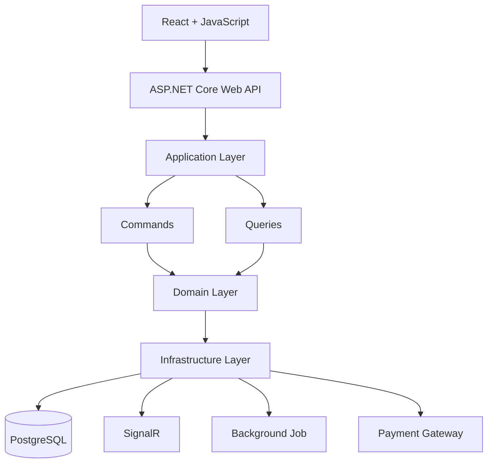

# Flight Booking Management System

A modern full-stack flight booking platform built with ASP.NET Core, React, Clean Architecture, and CQRS, providing a real-time seat reservation experience, secure online payments, and a comprehensive administration dashboard.

---

## Table of Contents

- Overview
- Key Features
- System Architecture
- Tech Stack
- Project Structure
- Installation
- Configuration
- Authentication & Authorization
- Realtime Features
- Future Improvements

---

## Overview

The Flight Booking Management System is a platform that allows users to search for flights, book seats in real time, complete secure online payments, and manage their bookings through an intuitive interface.

From the administrator's perspective, the system provides comprehensive tools for managing airports, airlines, aircraft, flight schedules, routes, bookings, services, users, and system operations from a single centralized dashboard.

---

## Key Features

### User Features

- **Register & Login** — secure authentication using JWT with role-based authorization
- **Search Flights** — find flights by departure, destination, date, airline, and seat class
- **View Flight Details** — browse schedules, aircraft information, available seats, and pricing
- **Real-time Seat Selection** — reserve seats with live synchronization powered by SignalR
- **Online Payments** — securely pay for bookings via integrated payment gateway
- **Booking History** — view current reservations and completed bookings
- **Manage Profile** — update personal information and account settings.

### Admin Features

- **Dashboard** — monitor key statistics and system activities
- **Manage Airports** — create, update, and organize airport information
- **Manage Airlines** — maintain airline records and operating information
- **Manage Airport** — manage aircraft details and seating configurations
- **Manage Routes** — configure routes between airports
- **Manage Flights** — schedule flights, assign aircraft, and manage seat availability
- **Manage Bookings** — monitor reservations, ticket status, and payment records
- **Manage Services** — configure additional services and ticket options
- **Manage Users & Roles** — control user accounts and role permissions
- **View Reports** — analyze bookings, revenue, and operational statistics
  
---

## System Architecture

The backend follows the Clean Architecture pattern combined with CQRS (Command Query Responsibility Segregation) to achieve a clear separation of concerns, improve maintainability, and support future scalability



---

## Tech Stack

| Category | Technologies |
|-----------|-------|
| **Frontend** | ReactJS, JavaScript, Vite |
| **Backend** | ASP.NET Core 8 Web API, C# |
| **Database** | PostgreSQL, Entity Framework Core |
| **Authentication** | ASP.NET Core Identity, JWT Authentication |
| **Real-time Communication** | SignalR |
| **Background Processing** | ASP.NET Core Background Service |
| **Payment Gateway** | VNPay (Sandbox) |
| **Validation & Mapping** | FluentValidation, Mapster |
| **Logging** | Serilog, Structured logging (Console + File sinks) |
| **Containerization** | Docker, Docker Compose, Nginx |
| **API Security** | CORS, Rate Limiting |
| **API Documentation** | Swagger / Swashbuckle  |
| **Asp.Versioning** | API versioning |

---

## Project Structure

```
FlightSystem/
├── API-FlightSystem/
│   ├── API-FlightSystem/
│   │   ├── Configurations/            # Application middleware and request pipeline configuration
│   │   ├── Controllers/               # REST API endpoints
│   │   ├── Logs                       # Serilog log files
│   │   ├── Properties/                # Launch settings and project properties
│   │   ├── Registers/                 # Dependency injection and service registration            
│   ├── Application/
│   │   ├── Behaviors/                 # MediatR pipeline behaviors (Validation, Logging, Transaction, ...)
│   │   ├── CQRS/                      # Commands, Queries, Handlers, DTOs
│   │   ├── Common/                    # Shared application models (API responses, pagination)
│   │   ├── Exceptions/                # Custom exception handling
│   │   ├── Hubs/                      # SignalR hub contracts and abstractions
│   │   ├── Interfaces/                # Service, repository, unit of work and hubs interfaces
│   │   ├── Mappers/                   # Mapster configuration
│   │   ├── ApplicationDI.cs           # Dependency injection registration
│   ├── Domain/
│   │   ├── Common/                    # Base entities
│   │   ├── Entities/                  # Domain entities
│   │   ├── Enums/                     # Enumerations
│   │   ├── Identity/                  # Identity domain models
│   ├── Infrastructure
│   │   ├── Database/                  # database configuration
│   │   ├── Migrations/                # Entity Framework Core migrations
│   │   ├── Persistences/              # DbContext and entity configurations
│   │   ├── Services/                  # External service implementations
│   │   ├── Repositories/              # Repository implementations
│   │   ├── UnitOfWork/                # Unit of Work implementation
│   └── Shared/
│   │   ├── Helpers/                   # Shared helper classes and utility functions
│   │   ├── Identity/                  # JWT settings and authentication models
│   │   ├── Logger/                    # # Centralized logging utilities
│
├── UI-FlightSystem
│   ├── src/
│   │   ├── api/                       # API clients and HTTP configuration
│   │   ├── app/                       # Application routing
│   │   ├── assets/                    # Static assets
│   │   ├── components/                # Reusable UI components
│   │   ├── features/                  # Feature-based modules
│   │   ├── hooks/                     # Custom React hooks
│   │   ├── layouts/                   # Application layouts
│   │   ├── lib/                       # Shared libraries and utilities
│   │   ├── utils/                     # Helper functions
│   ├── public/
```
---

## Installation

### Prerequisites

Before running the project, make sure the following tools are installed:
- .NET 8 SDK
- Node.js (v20 or later)
- PostgreSQL

### 1. Clone the reponsitory

```bash
git clone https://github.com/Tanhhh1/Flight-System.git
cd flight-system-main
```

### 2. Backend Setup

```bash
cd API-FlightSystem
dotnet restore
dotnet ef database update
dotnet run
```

### 3. Frontend Setup

```bash
cd UI-FlightSystem
npm install
npm run dev
```

---

## Configuation

Before starting the application, configure the required settings in appsettings.json (or environment variables)
```
"Database": {
  "Main": ""
},
"JwtConfiguration": {
  "SecretKey": "",
  "ValidAudience": "",
  "ValidIssuer": "",
  "TokenValidityInMinutes": ,
  "RefreshTokenValidityInDays": 
},
"VNPay": {
  "TmnCode": "",
  "HashSecret": "",
  "BaseUrl": "",
  "Version": "",
  "Command": "",
  "CurrCode": "",
  "Locale": ""
},
"Email": {
  "Host": "",
  "Port": "",
  "From": "",
  "Username": "",
  "Password": ""
}
```
---

## Authentication & Authorization

The application implements a secure authentication and authorization mechanism using **ASP.NET Core Identity** and **JWT (JSON Web Token)**

### Authentication

- **User Registration** — create a new account
- **User Login** — authenticate users and issue JWT access tokens
- **JWT Authentication** — secure API endpoints using bearer token authentication
- **Refresh Token** — obtain a new access token without requiring users to log in again
- **Logout** — revoke refresh tokens to prevent unauthorized reuse

### Authorize

Role-based authorization is applied throughout the system to restrict access to protected resources

| Role | Permissions |
| ----------------- | ------------------------------------------------------------------------------------------ |
| **Customer** | Search flights, book tickets, make payments, manage bookings, and update personal profile |
| **Staff** | Manage operational data such as bookings, services, and customer requests |
| **Administrator** | Full access to all management modules, user administration, and system configuration |

Protected endpoints require a valid JWT access token, while administrative operations are restricted using role-based authorization policies.

---

## Realtime Features

The application leverages SignalR to provide real-time communication between clients and the server, ensuring a consistent booking experience for all users

- **Live Seat Synchronization** — instantly update seat availability across all connected users
- **Duplicate Booking Prevention** — prevent multiple users from reserving the same seat simultaneously
- **Real-time Booking Status** — broadcast seat reservation and booking updates without requiring page refreshes
- **Automatic Seat Release** — release reserved seats when bookings expire or are cancelled, keeping availability up to date

---
